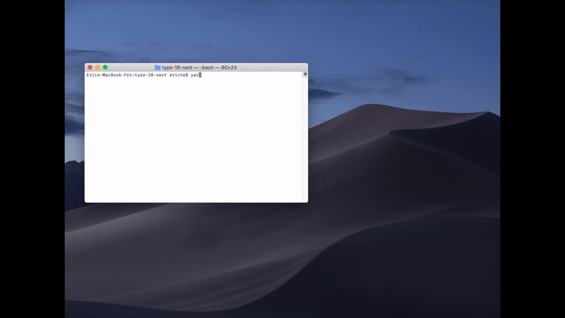

<h1>type-18-next</h1>

[![travis build][travis build]][travis build-url]

#### [Demo](https://type-18-next.vercel.app/)

<h2>contents</h2>

- [development](#development)
- [build and export](#build-and-export)
- [analyze bundle structure](#analyze-bundle-structure)
- [**Browser Automation**](#browser-automation)
- [Test](#test)
- [run with self defined server](#run-with-self-defined-server)
- [**Lint**](#lint)
- [**Develop**](#develop)
  - [**end points**](#end-points)
  - [**Apollo + GraphQL Demo structure**](#apollo--graphql-demo-structure)

## development
```bash
npm run dev
# OR
yarn run dev
```

```bash
PORT=3000 npm start
```

## build and export

```bash
npm run build
npm run export
# OR
yarn run build
yarn run export
```
combined command
```bash
npm run be
# OR
yarn run be
```

## analyze bundle structure
```bash
npm run analyze
# OR
yarn run analyze
```

## **Browser Automation**

```bash
npm run browser-automation -chrome
# OR
yarn run browser-automation -chrome
```

- does not support the other browsers on the [list](https://www.selenium.dev/selenium/docs/api/javascript/module/selenium-webdriver/lib/capabilities_exports_Browser.html)
- implemented with [`selenium-webdriver`](https://www.npmjs.com/package/selenium-webdriver) + [`chromedriver`](https://www.npmjs.com/package/chromedriver) (chrome >= 80)



## Test

```bash
npm test
# OR
yarn test
```
- enzyme configuration in `test/mocha.config.js`
- mocha configuration: `.mocharc.yml` include `test/mocha.config.js`

## run with self defined server

```bash
npm run express
npm run hapi
npm run koa
```

OR

```bash
yarn run express
yarn run hapi
yarn run koa
```

## **Lint**

use Eslint for code formatting

```bash
npm run lint
# OR
yarn run lint
```

## **Develop**
- The entry file for index page is `./src/pages/index.jsx`
  - routing paths in `./next.config.js` and routing files in `./src/pages`
  - dev server for each routing path use `async getServerSideProps`
- The router and redux store, actions, reducers are defined in `./src/client/js/settings`
- The entry file in server is `./src/server/index.js`

### **end points**

- development server

the next.js use [micro](https://www.npmjs.com/package/micro) to be the dev server

define the end points in `src/pages` and create file like `alive.jsx`, which will become `/alive`. Refer to [alive.jsx](./src/pages/alive.jsx) as an example

- production server
  - `src/server/express`
  - `src/server/hapi`
  - `src/server/koa`

### **Apollo + GraphQL Demo structure**

- dev
  - client: 
    - use `ApolloProvider` at `./src/pages/_app.jsx`
    - use `useQuery` and `useMutation` at `./src/client/js/components/Home/apollo-graphql-demo/LocalContext.jsx`
    - update local state and apollo cache after mutation
    - **leaflet css link tag was inserted into `./src/client/js/components/Nav.jsx` custom separater page Head**
    - in order to avoid render leaflet map on server side, use `next/dynamic` for dynamic loading, and disable `ssr`
  - server: 
    - use `micro` as dev server internally
    - use `next-dev-resolvers` and `type-defs` for `apollo-server-micro`
    - set up handler in `./src/pages/graphql.jsx`
- prod
  - client: 
    - same as the above dev client
  - server: 
    - use `resolvers` and `typeDefs` in `./src/server/utils/graphql`
    - use `apollo-server-hapi/koa/express` for hapi/koa/express server respectively
    - the used apollo middleware/server will read data from `./src/data/landmarks.geo.json` with node.js `fs` to mock up the process of data fetching.

[travis build]: https://travis-ci.org/1846689910/type-18-next.svg?branch=master
[travis build-url]: https://travis-ci.org/1846689910/type-18-next
